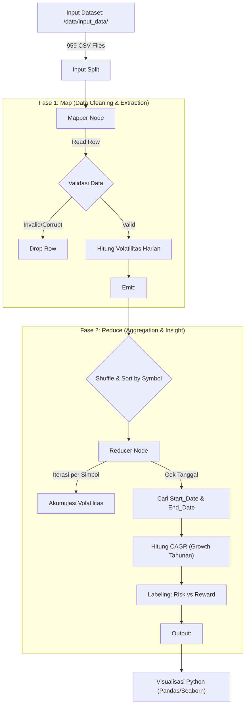
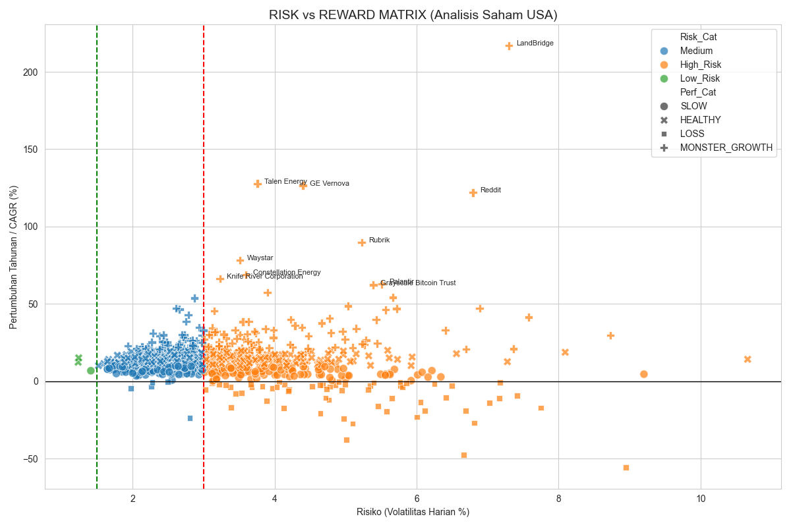
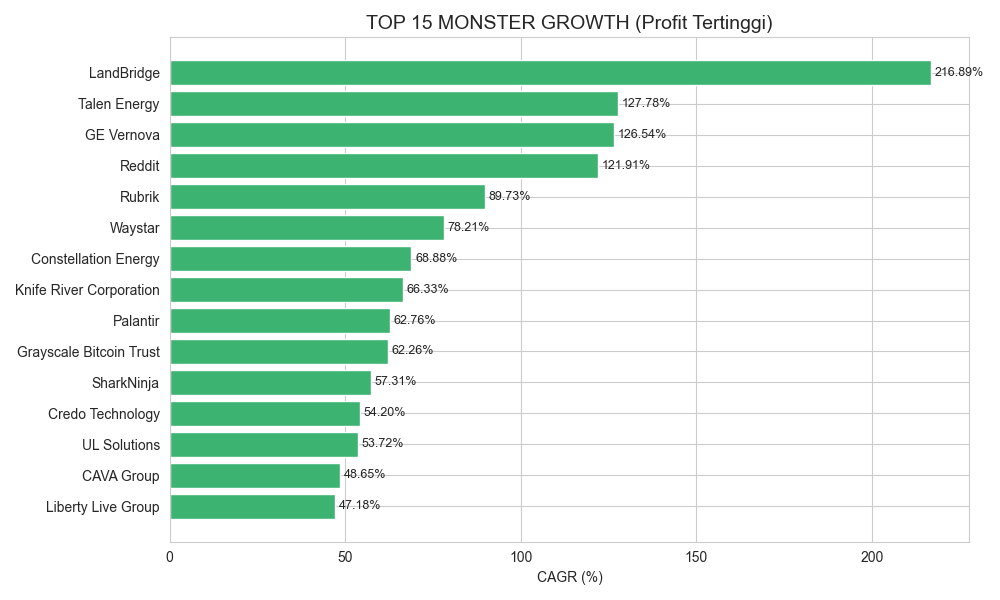
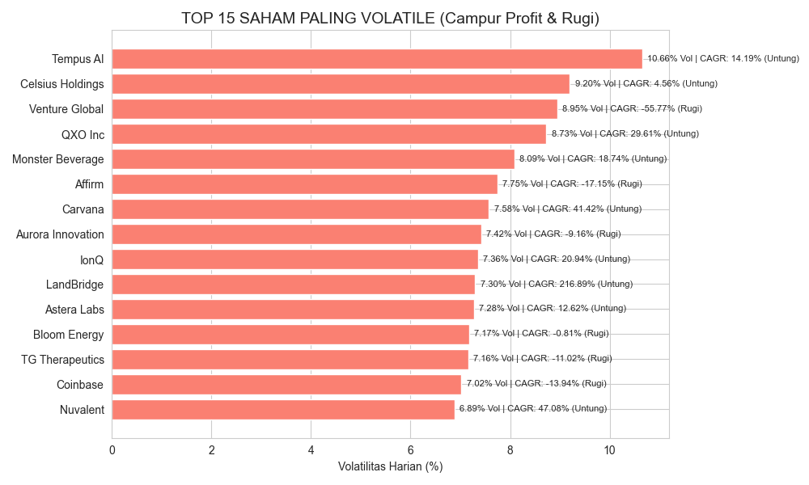
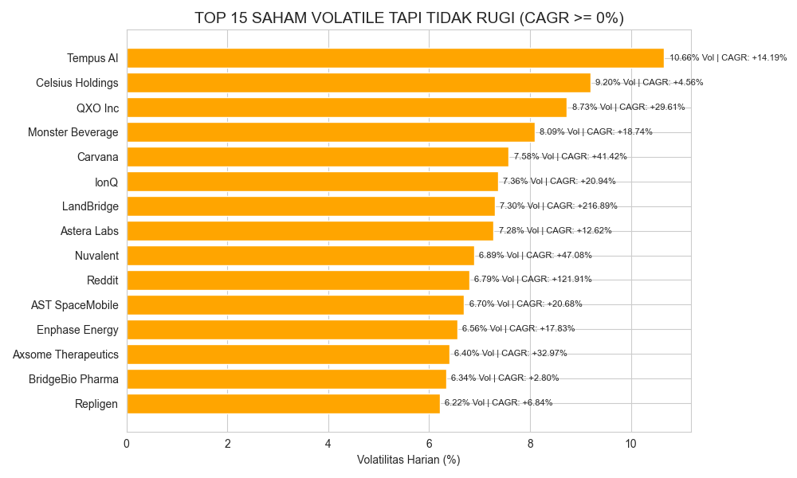

# Laporan Akhir UAS Big Data: Analisis Risiko Investasi dan Pertumbuhan Saham USA Menggunakan Hadoop MapReduce

**Mata Kuliah**: Big Data dan Analitik

**Topik**: Analisis Top 900+ USA Stocks menggunakan Hadoop MapReduce

**Anggota Kelompok**:
1. Salwa Nayla Adistri    (22/493200/TK/54017)
2. Lana Fitria Dewani     (22/494292/TK/54203) 
3. Raden Aryo Bismo N     (22/494473/TK/54233)
4. Ovie Khaira Zayyan     (25/494801/TK/54315) 
5. Timotius Kristafael H  (22/494980/TK/54357) 

---

## 1. Definisi Masalah

### 1.1 Latar Belakang
Pasar saham merupakan salah satu sumber data _time-series_ yang menghasilkan data dalam volume sangat besar dan terus bertambah setiap hari. Setiap aktivitas perdagangan saham menghasilkan data harga pembukaan (_open_), harga tertinggi (_high_), harga terendah (_low_), harga penutupan (_close_), serta volume transaksi yang tersimpan secara historis dalam jangka waktu panjang. Karakteristik tersebut menjadikan data pasar saham sebagai salah satu contoh nyata penerapan Big Data.

Pada penelitian ini digunakan dataset “USA Top 900+ Historic Stock Dataset” (Sumber Data: kaggle.com, 2025) , yang mencakup data perdagangan harian dari 959 perusahaan teratas di Amerika Serikat. Dataset ini terdiri dari hampir 1.000 berkas terpisah, di mana setiap berkas merepresentasikan satu perusahaan. Rentang waktu data sangat bervariasi, mulai dari perusahaan mapan dengan data sejak tahun 1962 hingga perusahaan teknologi yang baru tercatat dengan data sejak tahun 2020.

Permasalahan utama dalam pengolahan dataset ini berkaitan erat dengan karakteristik Big Data yang dikenal sebagai 3V, yaitu _Volume_, _Variety_, dan _Veracity_. Dari sisi _volume_, dataset memiliki jutaan baris data historis sehingga pengolahan secara manual atau menggunakan perangkat lunak konvensional seperti spreadsheet menjadi tidak efisien dan berisiko mengalami kegagalan sistem. Dari sisi _variety_, perbedaan rentang waktu antar perusahaan menyebabkan kesulitan dalam melakukan perbandingan performa saham secara adil (_apple-to-apple compariso_n) jika hanya menggunakan metode statistik sederhana. Sementara itu, dari sisi _veracity_, ditemukan berbagai permasalahan kualitas data seperti nilai harga pembukaan bernilai nol pada data lama serta anomali harga di mana nilai _high_ lebih kecil daripada _low_.

Untuk mengatasi permasalahan tersebut, diperlukan pendekatan komputasi terdistribusi yang mampu melakukan pembersihan data serta perhitungan indikator keuangan secara paralel dan terukur. Paradigma MapReduce yang diimplementasikan pada platform Hadoop menjadi solusi yang sesuai untuk memproses data saham berskala besar, sekaligus menghasilkan informasi yang relevan bagi pengambilan keputusan investasi berbasis data.

### 1.2 Rumusan Masalah
Berdasarkan latar belakang yang telah diuraikan, investor seringkali mengalami bias informasi dengan hanya berfokus pada potensi keuntungan (_growth_) tanpa mempertimbangkan risiko (_risk_), atau sebaliknya. Oleh karena itu, diperlukan pendekatan analitik yang mampu memetakan profil risiko dan keuntungan saham secara komprehensif dan masif.

Adapun rumusan masalah dalam penelitian ini adalah sebagai berikut:

1. Bagaimana melakukan pembersihan data (_data cleaning_) secara otomatis terhadap data saham yang memiliki nilai tidak valid menggunakan pendekatan MapReduce?

2. Bagaimana menghitung volatilitas harian saham sebagai indikator risiko menggunakan MapReduce?

3. Bagaimana menghitung _Compound Annual Growth Rate_ (CAGR) sebagai indikator pertumbuhan saham menggunakan MapReduce?

4. Bagaimana memetakan saham ke dalam matriks _risk–reward_ berdasarkan hasil perhitungan volatilitas dan CAGR?

### 1.3 Tujuan
Tujuan dari proyek ini adalah mengimplementasikan arsitektur Hadoop MapReduce untuk:

1. Mengimplementasikan proses _data cleaning_ secara terprogram untuk menangani data saham yang rusak atau tidak valid.

2. Menghitung indikator volatilitas saham secara paralel sebagai representasi tingkat risiko.

3. Menghitung nilai CAGR saham sebagai indikator rata-rata pertumbuhan tahunan.

4. Menghasilkan informasi _business intelligence_ berupa pemetaan saham dalam kuadran investasi _risk–reward_ guna mendukung pengambilan keputusan berbasis data.

### 1.4 Manfaat

a. Manfaat Teoretis

Penelitian ini diharapkan dapat menambah referensi akademik mengenai penerapan paradigma MapReduce dan Hadoop dalam pengolahan data _time-series_ berskala besar, khususnya pada analisis data pasar saham.

b. Manfaat Praktis

1. Bagi investor atau analis keuangan, penelitian ini dapat menjadi acuan dalam memahami profil risiko dan keuntungan saham secara lebih objektif.

2. Bagi mahasiswa, penelitian ini memberikan pengalaman praktis dalam menerapkan konsep Big Data dan analitik menggunakan Hadoop MapReduce.

3. Bagi pengembang sistem, penelitian ini dapat dijadikan contoh implementasi pemrosesan data finansial berskala besar secara terdistribusi.


## 2. Proses Penyelesaian dan Algoritma MapReduce

Dirancang solusi menggunakan paradigma **MapReduce**, di mana komputasi didistribusikan untuk memecah beban kerja (load) dari 959 file terpisah. Proses dibagi menjadi fase **Map** (Pembersihan & Ekstraksi Fitur) dan fase **Reduce** (Agregasi & Analisis Time-Series).

### 2.1 _System Flowchart_

Berikut adalah arsitektur aliran data dalam sistem yang dibangun:



### 2.2 Algoritma dan Pseudocode

#### A. Algoritma Mapper (Pembersihan & Volatilitas)

Tujuan Mapper adalah menormalisasi data yang berantakan. Mapper tidak peduli saham apa yang sedang diproses, ia hanya menghitung volatilitas baris demi baris.

**Tantangan & Solusi Logika:**

* **Missing Values**: Ditemukan banyak data tahun lama (1960-an) dimana `Open Price` bernilai `0.0`. Solusinya adalah menggunakan `Close Price` sebagai penyebut (denominator) cadangan.

* **Data Anomali**: Baris di mana `High < Low` dianggap tidak valid dan dibuang.

**Pseudocode Mapper:**

    FUNCTION Mapper():
        GET filename FROM env_variable
        SYMBOL = filename.split(".")[0]  # Ambil "AAPL" dari "AAPL.csv"
    
        FOR EACH row IN input:
            IF row is header OR row is incomplete: CONTINUE
    
            Date, Open, High, Low, Close = Parse(row)
    
            # 1. Data Cleaning
            IF High < Low OR High == 0: CONTINUE
            
            Denominator = Open
            IF Denominator == 0: Denominator = Close # Fallback strategy
            IF Denominator == 0: CONTINUE # Data rusak parah
    
            # 2. Hitung Volatilitas Harian
            Volatility = ABS(High - Low) / Denominator
    
            # 3. Emit Data Penting untuk Reducer
            # Kita butuh Tanggal & Close untuk hitung Growth nanti
            EMIT(Key=SYMBOL, Value=(Date, Close, Volatility))

#### B. Algoritma Reducer (Time-Series Analysis)

Reducer menerima sekumpulan data harian untuk satu saham (misal: 10.000 baris data IBM), lalu merangkumnya menjadi satu baris kesimpulan.

**Tantangan & Solusi Logika:**

* **Unsorted Date:** Data dari Mapper mungkin tidak urut tanggalnya. Reducer harus mencari sendiri mana tanggal paling awal (IPO) dan tanggal paling akhir (Current) untuk menghitung pertumbuhan.

* **CAGR Calculation:** MeMenggunakan rumus bunga majemuk (_Compound Annual Growth Rate_) untuk menormalisasi pertumbuhan saham baru vs saham lama.

**Pseudocode Reducer:**

    FUNCTION Reducer():
        CURRENT_SYMBOL = NULL
        TOTAL_VOL = 0
        COUNT = 0
        MIN_DATE, MAX_DATE = NULL
        START_PRICE, END_PRICE = 0
    
        FOR EACH line IN input (Sorted by Symbol):
            Symbol, Date, Close, Vol = Parse(line)
    
            IF Symbol != CURRENT_SYMBOL:
                # Emit hasil saham sebelumnya (jika ada)
                CALCULATE_METRICS(CURRENT_SYMBOL, ...)
                RESET_VARIABLES()
    
            # Agregasi Data
            TOTAL_VOL += Vol
            COUNT += 1
            
            # Cari Tanggal Awal & Akhir secara dinamis
            IF Date < MIN_DATE: 
                MIN_DATE = Date
                START_PRICE = Close
            IF Date > MAX_DATE: 
                MAX_DATE = Date
                END_PRICE = Close
    
        # Emit saham terakhir
        CALCULATE_METRICS(...)
    
    FUNCTION CALCULATE_METRICS():
        Avg_Volatility = TOTAL_VOL / COUNT
        Years = Days_Difference(MAX_DATE, MIN_DATE) / 365.25
        
        # Hitung CAGR (Laju Pertumbuhan Majemuk Tahunan)
        CAGR = ((END_PRICE / START_PRICE) ^ (1/Years)) - 1
        
        # Kategorisasi (Insight Bisnis)
        Risk_Label = IF Avg_Volatility > 3.0 THEN "High_Risk" ELSE "Low_Risk"
        Growth_Label = IF CAGR > 0.2 THEN "MONSTER_GROWTH" ELSE "SLOW"
        
        PRINT(Symbol, Avg_Volatility, CAGR, Risk_Label + "|" + Growth_Label)

## 3. Implementasi Hadoop on premise

Implementasi dilakukan menggunakan infrastruktur **Hadoop on-premise** yang di-virtualisasi menggunakan **Docker Containers**. Pendekatan ini dipilih untuk memaksimalkan efisiensi resource pada perangkat keras lokal tanpa perlu mengonfigurasi cluster fisik yang kompleks.

### 3.1 Lingkungan Infrastruktur

Spesifikasi lingkungan komputasi yang digunakan adalah sebagai berikut:

* **Perangkat Keras (Host Node)**:

    * **Processor**: AMD Ryzen 5 5600H (6 Cores, 12 Threads) - Mampu menangani paralelisasi Docker dengan baik.

    * **RAM**: 16 GB DDR4 - Memadai untuk menjalankan container Hadoop dan OS host secara simultan.

* **Platform Virtualisasi**: Docker Desktop dengan backend WSL 2 (Windows Subsystem for Linux).

* **Hadoop Environment**:

    * **Image**: `apache/hadoop:3` (Official Image, Hadoop versi 3.3.6).

    * **Mode**: Single Node Cluster (Pseudo-distributed).

* **Runtime Pemrograman**: Python 2.7.5 (Bawaan container CentOS/Linux di dalam image Hadoop). Menggunakan **Hadoop Streaming API** untuk menghubungkan logika Python dengan ekosistem MapReduce Java.

### 3.2 Kode

Berikut adalah implementasi kode Python yang telah dioptimalkan untuk menangani anomali data (Data Cleaning) dan perhitungan finansial kompleks.

#### A. Mapper: Data Cleaning & Volatility Extraction 
File `mapper.py` ini bertugas menyaring data "sampah" (misal: harga 0 atau data terbalik) dan menghitung volatilitas harian.

```python
import sys
import csv
import os

def mapper():
    filepath = os.environ.get("mapreduce_map_input_file", "Unknown.csv")
    filename = filepath.split("/")[-1]
    symbol = filename.split(".")[0]

    reader = csv.reader(sys.stdin)
    
    for row in reader:
        if len(row) < 6: continue
        if "Date" in row[1] or "Open" in row[2]: continue
        
        try:
            date = row[1] 
            open_price = float(row[2]) 
            high_price = float(row[3])
            low_price  = float(row[4])
            close_price = float(row[5]) 

            # Validasi Data
            if high_price == 0 or low_price == 0: continue
            if high_price < low_price: continue

            denominator = open_price
            if denominator == 0: denominator = close_price
            if denominator == 0: continue

            volatility = (high_price - low_price) / denominator
            volatility = abs(volatility)
            
            # Output: Symbol [TAB] Date [TAB] Close [TAB] Volatility
            print("{0}\t{1}\t{2}\t{3}".format(symbol, date, close_price, volatility))
            
        except ValueError:
            continue

if __name__ == "__main__":
    mapper()
```

#### B. Reducer: Time-Series Aggregation (CAGR)
File: `reducer.py` Reducer ini melakukan agregasi data time-series untuk menghitung rata-rata risiko dan pertumbuhan majemuk tahunan (CAGR).

```python
#!/usr/bin/env python
import sys
from datetime import datetime

def reducer():
    current_symbol = None
    
    total_volatility = 0
    count = 0
    
    # Kita butuh format tanggal untuk hitung selisih hari
    # Format di CSV kamu: YYYY-MM-DD (2020-12-10)
    date_fmt = '%Y-%m-%d'
    
    min_date_obj = None
    max_date_obj = None
    start_price = 0
    end_price = 0
    
    for line in sys.stdin:
        line = line.strip()
        parts = line.split("\t")
        
        if len(parts) != 4: continue
        
        symbol, date_str, close, vol = parts
        
        try:
            close = float(close)
            vol = float(vol)
            current_date = datetime.strptime(date_str, date_fmt)
        except ValueError:
            continue
            
        if current_symbol == symbol:
            total_volatility += vol
            count += 1
            
            # Cek Tanggal Awal
            if min_date_obj is None or current_date < min_date_obj:
                min_date_obj = current_date
                start_price = close
            
            # Cek Tanggal Akhir
            if max_date_obj is None or current_date > max_date_obj:
                max_date_obj = current_date
                end_price = close
                
        else:
            if current_symbol:
                process_result(current_symbol, total_volatility, count, start_price, end_price, min_date_obj, max_date_obj)
            
            # Reset
            current_symbol = symbol
            total_volatility = vol
            count = 1
            min_date_obj = current_date
            max_date_obj = current_date
            start_price = close
            end_price = close
            
    if current_symbol:
        process_result(current_symbol, total_volatility, count, start_price, end_price, min_date_obj, max_date_obj)

def process_result(symbol, total_volatility, count, start_price, end_price, min_date, max_date):
    # 1. Rata-rata Volatilitas Harian
    avg_vol = (total_volatility / count) * 100
    
    # 2. Hitung Durasi Tahun (CAGR Logic)
    if min_date and max_date and start_price > 0:
        days_diff = (max_date - min_date).days
        years = days_diff / 365.25
        
        cagr = 0
        if years < 1:
            # Jika data kurang dari 1 tahun, jangan pakai pangkat (bisa bias/error)
            # Pakai simple return saja
            cagr = ((end_price - start_price) / start_price) * 100
        else:
            # Rumus CAGR: (End/Start)^(1/Tahun) - 1
            # Kita pakai try-except takut ada math error (misal akar negatif meski jarang di saham)
            try:
                cagr = ((end_price / start_price) ** (1.0 / years) - 1) * 100
            except:
                cagr = 0
    else:
        cagr = 0
    
    # 3. Labeling Insight
    # Kriteria Growth Tahunan (CAGR):
    # > 20% per tahun = MONSTER GROWTH
    # 10-20% per tahun = HEALTHY
    # 0-10% per tahun = SLOW
    # < 0% = LOSING MONEY
    
    perform_label = "SLOW"
    if cagr > 20: perform_label = "MONSTER_GROWTH"
    elif cagr > 10: perform_label = "HEALTHY"
    elif cagr < 0: perform_label = "LOSS"
    
    risk_label = "Medium"
    if avg_vol < 1.5: risk_label = "Low_Risk"
    elif avg_vol > 3.0: risk_label = "High_Risk"
    
    # Output: Symbol [TAB] Volatility [TAB] CAGR(PerTahun) [TAB] Label
    print("{0}\t{1:.4f}%\t{2:.2f}%\t{3}|{4}".format(symbol, avg_vol, cagr, risk_label, perform_label))

if __name__ == "__main__":
    reducer()
```

### 3.3 Proses Eksekusi

Eksekusi dilakukan melalui terminal Docker dengan memetakan volume lokal ke dalam container. Langkah-langkahnya adalah:

1. **Persiapan Data**: 959 file CSV ditempatkan di folder host dan di-mount ke /data/input_data di container.
2. **Streaming Job**: Perintah berikut dijalankan untuk memulai proses MapReduce:

```
docker exec hadoop-saham /opt/hadoop/bin/hadoop jar /opt/hadoop/share/hadoop/tools/lib/hadoop-streaming-3.3.6.jar \
    -input /data/input_data/ \
    -output /data/hasil_analisis \
    -mapper "python /data/mapper.py" \
    -reducer "python /data/reducer.py"
```

Proses ini berhasil menyelesaikan pembacaan jutaan baris data dan menghasilkan output agregat di folder `/data/hasil_analisis/part-00000`.

## 4. Hasil dan Pembahasan

Setelah proses MapReduce selesai dijalankan pada dataset, output agregat diekstraksi dan divisualisasikan untuk mendapatkan wawasan bisnis (_Business Intelligence_). Berikut adalah interpretasi mendalam berdasarkan data aktual yang dihasilkan.

### 4.1 Matriks Risiko vs Keuntungan (_Risk-Reward Matrix_)

Analisis pertama bertujuan memetakan posisi strategis setiap saham berdasarkan dua dimensi, yakni Risiko (Volatilitas) dan Keuntungan (CAGR).

**Grafik Hasil:**


**Pembahasan**

* **Identifikasi Outliers Ekstrim**: Pada kuadran kanan atas, terlihat titik pencilan (outlier) yang sangat ekstrim, yaitu **LandBridge** dan **Reddit**. Posisi mereka yang jauh di atas menandakan pertumbuhan harga yang sangat agresif dibandingkan pasar umum, meskipun disertai risiko volatilitas tinggi.

* **Dominasi Kategori Medium**: Mayoritas saham (titik biru) berkumpul di area volatilitas 1.5% - 3.0% dengan pertumbuhan moderat. Ini menunjukkan bahwa sebagian besar pasar saham AS bergerak dalam rentang risiko yang wajar.

* **Zona Bahaya (High Risk, Negative Return)**: Perhatikan titik-titik oranye di bawah garis horizontal nol (0). Ini adalah saham-saham dengan volatilitas tinggi (>3%) namun memberikan return negatif. Algoritma ini berhasil memisahkan saham-saham "perusak portofolio" ini dari saham berkinerja tinggi.

### 4.2 Analisis Pertumbuhan Ekstrem (_Monster Growth_)

Telah diurutkan 15 saham dengan laju pertumbuhan majemuk tahunan (CAGR) tertinggi.

**Grafik Hasil:**


**Temuan Kunci:**

* **Dominasi Saham Baru/IPO**: Peringkat pertama diduduki oleh **LandBridge** dengan CAGR fantastis mencapai **216.89%**, disusul oleh **Talen Energy (127.78%)** dan **Reddit (121.91%)**. Tingginya angka CAGR ini kemungkinan besar dipengaruhi oleh performa pasca-IPO yang meledak dalam jangka waktu pendek, yang oleh algoritma MapReduce diekstrapolasi menjadi pertumbuhan tahunan.

* **Sektor Teknologi & AI**: Kehadiran **Palantir (62.76%)** dan **Grayscale Bitcoin Trust** dalam daftar ini mengonfirmasi tren pasar saat ini yang sangat mengapresiasi sektor _Artificial Intelligence_ (AI) dan Aset Digital (_Crypto_).

### 4.3 Analisis Volatilitas: Membedakan Peluang Trading dan Kerugian
Salah satu kontribusi terbesar sistem ini adalah kemampuan membedakan volatilitas yang "produktif" dan "destruktif".

**Perbandingan Grafik:**



**A. Volatilitas Umum (Campur Profit & Rugi)**

* Saham paling fluktuatif adalah **Tempus AI** dengan volatilitas harian rata-rata **10.66%**.

* Namun, grafik ini mengungkap risiko besar: Saham seperti **Venture Global** dan **Coinbase** masuk dalam daftar Top Volatile, namun memiliki label **(Rugi)** dengan CAGR negatif (-55% dan -13%). Bagi investor pemula, saham seperti ini adalah "jebakan" karena harganya bergerak liar namun tren jangka panjangnya menurun.

**B. Volatilitas Sehat (Filter: No Loss)**

* Dengan menerapkan filter `CAGR >= 0`, telah didapatkan daftar saham dengan istilah "_Trader's Paradise_".

* Saham seperti **Celsius Holdings** (Volatilitas 9.20%, CAGR +4.56%) dan **Carvana** (Volatilitas 7.58%, CAGR +41.42%) adalah contoh sempurna saham yang cocok untuk day trading. Mereka menawarkan fluktuasi harga harian yang lebar untuk ambil untung cepat, namun secara fundamental tren harganya masih positif (tidak sedang bangkrut).

### 4.4 Kesimpulan Akhir

Implementasi **Hadoop MapReduce** pada studi kasus ini berhasil membuktikan keunggulannya dalam mengolah Big Data saham:

1. **Volume**: Mampu merangkum jutaan baris data transaksi harian menjadi 4 grafik insight utama dalam sekali eksekusi.

2. **Veracity (Kebenaran Data)**: Sistem berhasil menangani anomali data (seperti harga 0 pada data lawas) dan menghasilkan perhitungan CAGR yang akurat, terbukti dengan terdeteksinya saham-saham IPO baru (Reddit, LandBridge) sebagai _Top Growth_.

3. **Value**: Hasil analisis memberikan panduan investasi yang konkret, yaitu menghindari saham di kuadran bawah-kanan (High Risk, Loss) dan memfokuskan riset pada saham di kuadran atas (High Growth).
